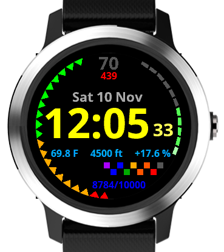

# garmin-simple-sensor
A simple sensor-heavy watchface for Garmin 240x240 round smartwatches.

## Legend
* _Left_: Battery meter
* _Right_: Floors climbed meter
* _Lower Right_: Steps progression checkerboard
* _Top_: Heartrate and daily calories
* _Middle Right_: Minor sensors.
** _The rightmost percentage value indicates the air pressure deviation from 1 ATM._

## Supported Devices
* Approach S60[^1]
* D2 Charlie (Needs different alignments for text values)
* D2 Delta / Delta PX / Delta S (ditto)
* Descent Mk1 (ditto)
* Fēnix 5/5 Plus/5S Plus/5X Plus (ditto)
* Forerunner 645 / 645 Music (ditto)
* Forerunner 935 (ditto)
* Vívoactive 3[^2] / 3 Music
* TODO: Add duplicate devices using the same hardware here after all alignment issues fixed.

[^1] Due to device limitations, the floors climbed and minor sensors are not displayed.
[^2] This application is optimized for the Vívoactive series.
